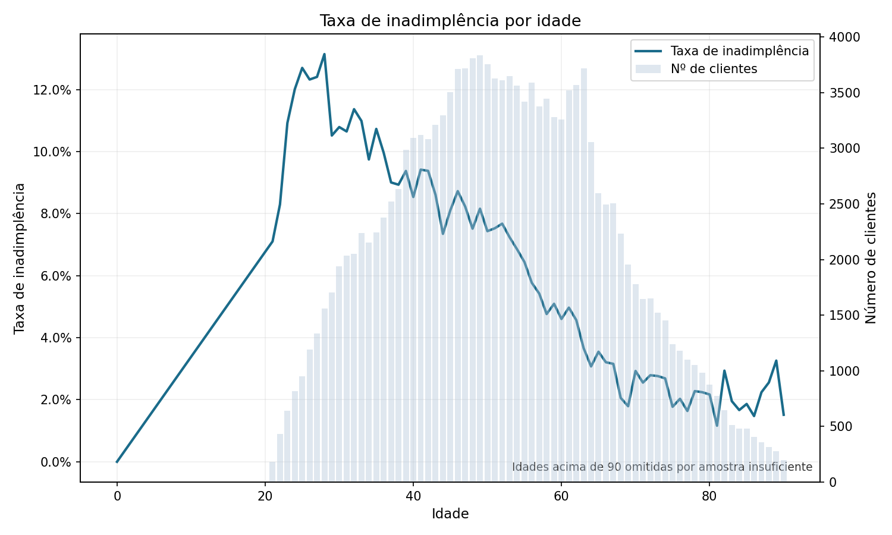
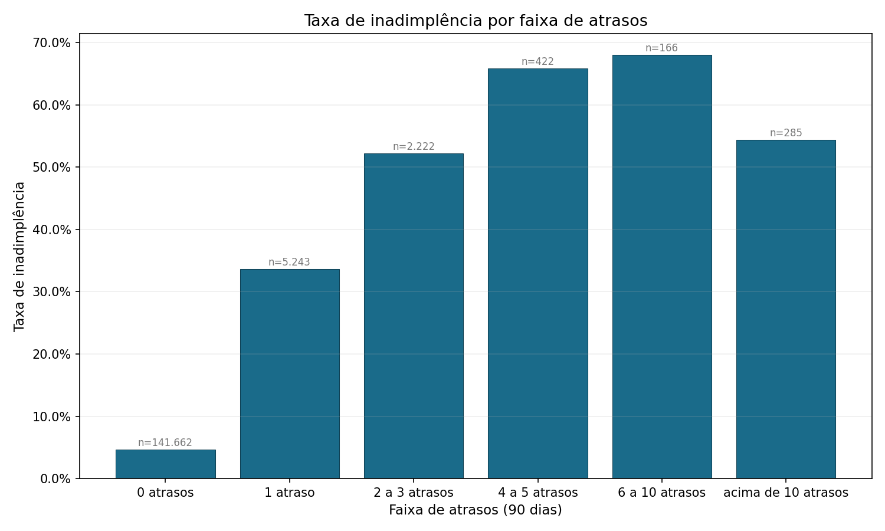
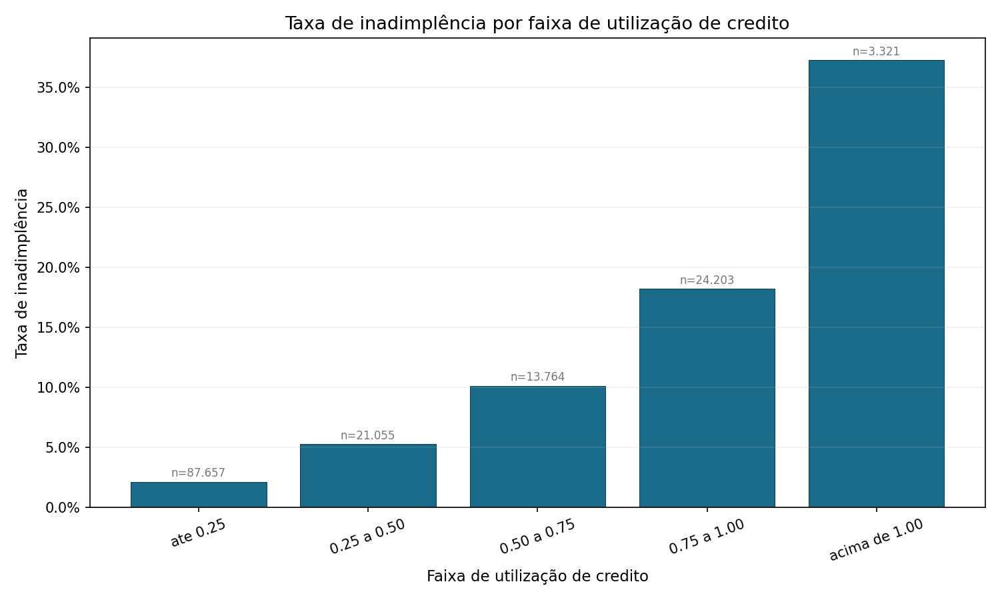
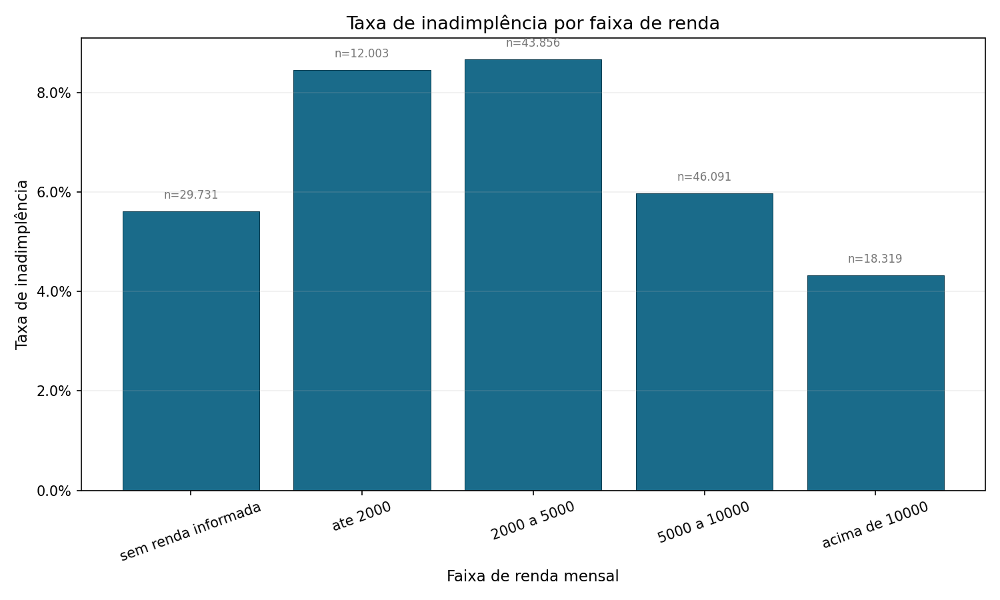
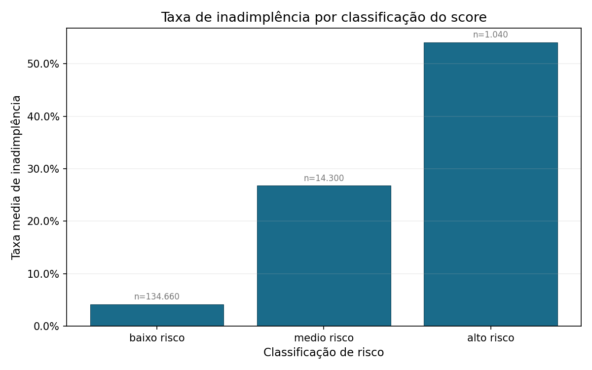

# Análise de Risco de Crédito com Score Explicável
(Python, SQL e SQLite)

No Brasil, mais de 80 milhões de pessoas estão inadimplentes. Decidir quem
recebe crédito — e em que condições — é um dos problemas mais concretos do
mercado financeiro. Este projeto aborda exatamente isso.

## 1. Visão geral e objetivo
Projeto desenvolvido para portfólio com foco em vagas no mercado financeiro,
fintechs e áreas de risco de crédito. O problema é direto: identificar clientes
com maior probabilidade de não pagar. A abordagem também — um score simples,
baseado em regras claras, fácil de explicar e de aplicar na prática.

## 2. Tecnologias utilizadas
- Python 3
- pandas
- matplotlib
- numpy
- SQL
- SQLite (`sqlite3`)
- pathlib

## 3. Estrutura do projeto
```text
analise-risco-credito/
|-- dados/
|   |-- brutos/
|   |   `-- cs-training.csv
|   |-- tratados/
|   |   `-- risco_credito.db
|   `-- dicionario/
|       `-- descricao_variaveis.md
|-- graficos/
|   |-- inadimplencia_por_atrasos_90dias.png
|   |-- inadimplencia_por_idade.png
|   |-- inadimplencia_por_renda.png
|   |-- inadimplencia_por_utilizacao_credito.png
|   `-- taxa_inadimplencia_por_classificacao_score.png
|-- sql/
|   `-- 01_criar_tabela_raw.sql
|-- src/
|   |-- importar_csv_sqlite.py
|   |-- explorar_base.py
|   |-- analise_idade_risco.py
|   |-- analise_atrasos_risco.py
|   |-- analise_utilizacao_credito_risco.py
|   |-- analise_renda_risco.py
|   |-- construir_score_risco.py
|   |-- resumo_score_risco.py
|   `-- executar_pipeline.py
|-- requirements.txt
`-- README.md
```

## 4. Base de dados
- Fonte: dataset público do Kaggle (arquivo `cs-training.csv`)
- Caminho no projeto: `dados/brutos/cs-training.csv`
- Tabela principal no banco: `credito_raw`
- Variável-alvo de inadimplência: `SeriousDlqin2yrs`

## 5. Etapas do projeto
1. Importação do CSV para SQLite.
2. Exploração inicial da base para validar estrutura, tipos de dados e
   valores faltantes.
3. Análises de inadimplência por idade, atrasos graves, utilização de
   crédito e renda.
4. Construção do score de risco com regras de negócio.
5. Classificação final em baixo, médio e alto risco.
6. Geração de resumo tabular e visual da classificação final.

## 6. Principais análises realizadas
- Taxa geral de inadimplência da base (média de `SeriousDlqin2yrs`).
- Análise por idade (`age` x taxa de inadimplência).
- Análise por atrasos graves (`NumberOfTimes90DaysLate` x taxa de inadimplência).
- Análise por utilização de crédito (`RevolvingUtilizationOfUnsecuredLines`
  em faixas).
- Análise por renda (`MonthlyIncome` em faixas, incluindo casos sem renda
  informada).

## 7. Lógica do score de risco
O score final é uma regra simples e interpretável de segmentação de risco: a pontuação total é a soma dos pontos de cada critério abaixo.

1. **Histórico de atrasos graves** (NumberOfTimes90DaysLate)
   - == 0 → 0 pontos  
   - == 1 → 2 pontos  
   - >= 2 → 3 pontos  

2. **Utilização de crédito** (RevolvingUtilizationOfUnsecuredLines)
   - <= 0.50 → 0 pontos  
   - > 0.50 e <= 1.00 → 1 ponto  
   - > 1.00 → 2 pontos  

3. **Renda mensal** (MonthlyIncome)
   - isna() (sem renda informada) → 1 ponto  
   - > 5000 → 0 pontos  
   - >= 2000 e <= 5000 → 1 ponto  
   - < 2000 → 2 pontos  
   > *Clientes sem renda informada recebem 1 ponto pela ausência da informação, não pelo comportamento. Na base, esse grupo teve inadimplência menor que as faixas de renda baixa, mas a falta de dado foi tratada de forma conservadora.*

4. **Idade** (`age`)
   - >= 18 e <= 29 → 1 ponto  
   - >= 30 → 0 pontos  

**Classificação final:**
- **baixo risco**: score total de **0 a 2**
- **médio risco**: score total de **3 a 5**
- **alto risco**: score total de **6 ou mais**

Resultado salvo em SQLite na tabela credito_score.

## 8. Principais resultados
- Taxa geral de inadimplência da base: **6,7%**.
- **Baixo risco**: inadimplência de **4,2%**.
- **Médio risco**: inadimplência de **26,8%**.
- **Alto risco**: inadimplência de **54,1%**.

O score separa bem os três grupos — e os padrões por idade, atrasos,
utilização de crédito e renda são consistentes com o que se espera
num problema real de crédito.

## Contexto brasileiro
O dataset é americano por uma razão prática: no Brasil, dados individuais
de crédito não são disponibilizados publicamente por conta do sigilo
bancário e da LGPD. Mesmo assim, os padrões que o projeto analisa fazem
total sentido no contexto nacional.

- Segundo a PEIC/CNC (fev/2025), **76,4%** das famílias estavam endividadas
  e **28,6%** tinham contas em atraso.
- O Mapa da Inadimplência da Serasa (jan/2026) registrou **81,3 milhões**
  de consumidores inadimplentes, com **R$ 524 bilhões** em débitos ativos.
- Os débitos se concentram em bancos/cartões (26,3%), contas básicas (22,0%)
  e financeiras (19,8%) — exatamente as frentes que as variáveis do score
  buscam capturar.

## Visualizações principais










## 9. Como executar o projeto
1. Instale as dependências:
```bash
pip install -r requirements.txt
```

2. Execute os scripts na ordem sugerida:
```bash
python src/importar_csv_sqlite.py
python src/explorar_base.py
python src/analise_idade_risco.py
python src/analise_atrasos_risco.py
python src/analise_utilizacao_credito_risco.py
python src/analise_renda_risco.py
python src/construir_score_risco.py
python src/resumo_score_risco.py
```

3. Ou execute todo o pipeline de uma vez:
```bash
python src/executar_pipeline.py
```

No Windows, você pode usar `py` no lugar de `python`.

## 10. Próximos passos
1. Evoluir o dicionário de dados em `dados/dicionario/descricao_variaveis.md`.
2. Adicionar testes automatizados para validar as regras do score.
3. Testar regressão logística como benchmark em relação ao score por regras.
4. Avaliar a importância das variáveis para a separação de risco.
5. Testar novas segmentações de variáveis e faixas de corte.
6. Criar um dashboard interativo para exploração dos resultados.


